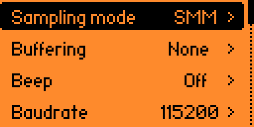
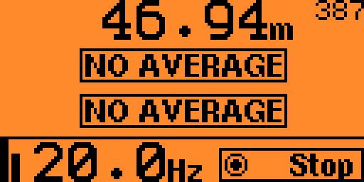
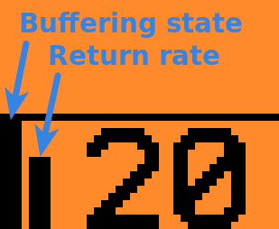
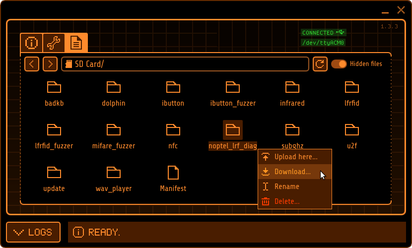
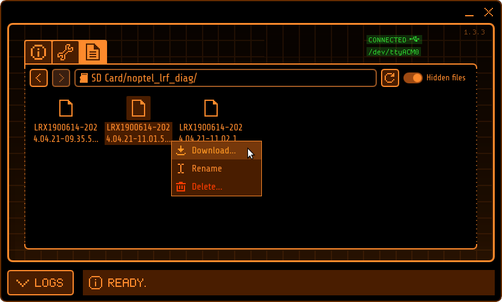
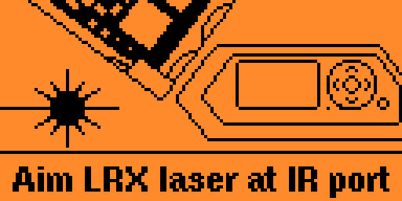
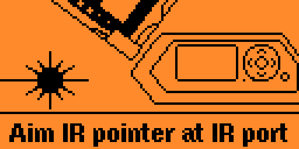
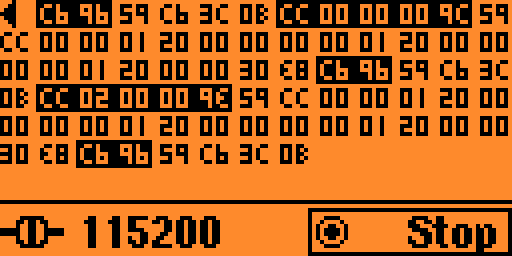

# Noptel LRF rangefinder sampler app for the Flipper Zero
### Version 1.7

* [Usage](#Usage)
* [Installation](#Installation)
* [Notes](#Notes)
* [License](#License)

Flipper Zero app to get range measurements from a [Noptel](https://noptel.fi/) [LRF rangefinder](https://noptel.fi/rangefinderhome).

#### Functions

- Rangefinding in all modes
- Distance and amplitude averaging
- Return rate display
- Laser pointer control
- LRF information display
- Saving diagnostic data
- Rangefinder laser testing
- IR laser pointer testing
- USB serial passthrough

https://github.com/Giraut/flipper_zero_noptel_lrf_sampler/assets/37288252/bae70910-ead5-4b63-9a32-cbc670b7adfa

## Usage

Start the application in **Apps ▶ GPIO**.

The main menu opens:

### Configuration

In the configuration menu, select the sampling mode:

- **SMM**: single measurement mode (default)
- **Auto SMM**: single measurement mode, auto-repeating
- **1 Hz** ▶ **200 Hz**: continuous measurement mode at the selected sampling rate

Set **Buffering** to buffer samples in automatic SMM or continuous measurement mode for either:

- **None**: no buffering (default)
- **1 s** ▶ **10 s**
- **5 samples**, **10 samples**, **100 samples** or **1000 samples**

Enable **Beep** to hear a short beep when a valid sample is received.

Set **Baudrate** to either:

- **115200** bps (default)
- **57600** bps
- **38400** bps
- **19200** bps
- **9600** bps

### Sample

Select the **Sample** option to start sampling the LRF.

#### Single measurement mode

In single measurement mode, press the **OK** button to get another measurement.

Up to 3 distances can be measured in one sample (several targets in the line of sight).

Each measured distance is displayed on one line.

The associated amplitude - i.e. signal strength - is displayed as a small number next to the distance.

#### Continuous measurement mode

In continuous measurement mode or automatic SMM mode, press the **OK** button to start and stop the measurements.

Distances and amplitudes are displayed like in single measurement mode.

The effective sampling rate in Hertz is calculated and displayed at the bottom.

#### Buffering

If buffering is enabled, the following information is calculated:

- Average distances for all valid samples
- Average amplitudes - i.e. average signal strengths - for all valid samples
- Return rate - i.e. number of samples containing any measured distance vs. total number of samples

The average distances and amplitudes are displayed instead of the last sample's.

The buffering state is displayed at the bottom left: the bar is all the way up when the buffer is full.

The return rate is indicated next to the buffering state: the bar is all the way up when the return rate is 100% - meaning no missed measurements.

The buffering state and the return rate indicators are useful to determine the rangefinder's extinction ratio: when the buffer is full, the return rate bar should be only about ½ to ¾ full at extinction ratio.

https://github.com/Giraut/flipper_zero_noptel_lrf_sampler/assets/37288252/32d81367-356f-4cd8-96aa-deab03e2f29c

### Pointer ON/OFF

Select the **Pointer ON/OFF** toggle to turn the pointer on and off if the rangefinder is equipped with a pointer.

The pointer is useful to train the rangefinder on a short distance target.

### LRF information

Select the **LRF information** option to view the LRF's identification information. Press the **OK** button to re-read the information, or read another LRF's.

### Save LRF diagnostic

Select the **Save LRF diagnostic** option to save the LRF's diagnostic data after a failed ot incorrect measurement. Press the **OK** button to save another set of diagnostic data or another LRF's.

DSP files may be submitted to Noptel for analysis, along with a description of the problem with the rangefinder.

To recover the DSP files, connect the Flipper Zero to the computer with a USB cable and use [qFlipper](https://docs.flipper.net/qflipper) to download the the **noptel_lrf_diag** directory:

DSP files inside the **noptel_lrf_diag** directory may be downloaded individually also:

### Test LRX laser

Select the **Test LRX laser** option to test an LRX's transmitter laser. *(See note below)*

### Test IR pointer

Select the **Test IR pointer** option to test an LRF's infrared pointer. *(See note below)*

### USB serial passthrough

The **USB serial passthrough** function lets a computer connected to the Flipper Zero's USB port and running a LRF client software communicate with the LRF as if the LRF was connected directly to the computer with a USB serial cable. The Flipper Zero transparently relays data between the computer and the LRF.

The first screen, accessible with the left arrow, shows the overall amount of serial traffic going to and from the LRF:

The second screen, accessible with the right arrow, shows the actual traffic: bytes sent to the LRF are showed on a black background while bytes sent by the LRF are showed normally.

### About

Gives information about the app and the GPIO pin connections needed to connect an LRF rangefinder to the Flipper Zero. Use the **OK** button or the arrows to switch pages.

## Installation

- Clone this repository
- Install [uFBT](https://github.com/flipperdevices/flipperzero-ufbt)
- Connect the Flipper Zero to the computer with a USB cable
- cd into the repository
- Invoke `ufbt launch` to install the app in the **Apps ▶ GPIO** menu and run it for the first time

## Notes

- Pin #15 (C1) may be used to control the LRF's power supply through a power MOSFET or a relay for example. If used, the app will turn on the rangefinder upon starting and turn it back off when exiting. This is useful if the LRF is battery-powered to keep the rangefinder connected to the Flipper Zero and conserve the battery when not in use. The use of this pin is entirely optional.

- LRX-series rangefinders may also be used with the app. However, they are usually configured as RS232 or RS422 serial devices, not as UART serial devices. Therefore, a UART-to-RS232 or UART-to-RS422 converter is usually required to connect the Flipper Zero's UART lines to an LRX rangefinder.

- Only certain rangefinger models' lasers can be tested with the **Test LRX laser** function, most notably LRX-class rangefinders - hence the name of the function - but also certain LRF rangefinders. Depending on the particular model, despite nominally working in the far-infrared, 1.5 µm lasers can leak near-infrared light around 950 nm that can be picked up by the Flipper Zero's [infrared receiver](https://www.vishay.com/docs/82495/tsop753.pdf) at close range.

    Your particular rangefinder may be detected by the Flipper Zero, but there is no guarantee that it will be, as this function exploits a side effect of the laser diode that the rangefinders' design doesn't account for. If your rangefinder's laser isn't detected, do not assume it is malfunctioning! If it is detected however, you can be quite sure it is functioning well.

    LRF rangefinders such as the LRF125 that work in the near-infrared are easily detected by the Flipper Zero despite using a lower power laser diode, and can be reliably diagnosed using the Flipper Zero.

- Some rangefinders are equipped with a low power, near-infrared pointer instead of a visible light pointer. Near-infrared pointers can be easily detected and reliably diagnosed by the Flipper Zero also, using the **Test IR pointer** function.

- Each sample requires 220 bits to transfer over serial. If the baudrate is too low, the serial link may not provide enough bandwidth to sustain the desired rate of sampling:

  - At 38400 bps, the sampling rate is capped at 174 Hz
  - At 19200 bps, the sampling rate is capped at 87 Hz
  - At 9600 bps, the sampling rate is capped at 43.5 Hz

- The lower the baudrate, the longer saving diagnostic data takes. At 9600 bps, it takes upward of 50 seconds, while it only takes 5 seconds at 115200 bps

## License

MIT
