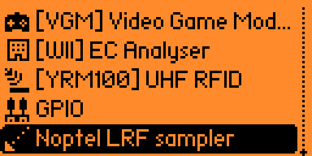
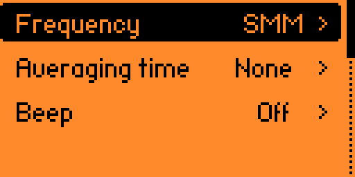
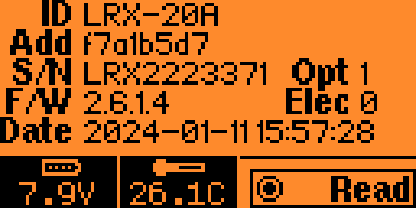
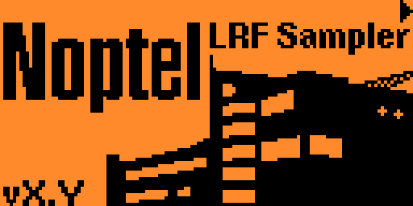
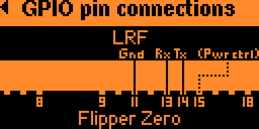

# Noptel LRF rangefinder sampler app for the Flipper Zero
### Version 1.1

* [Usage](#Usage)
* [Installation](#Installation)
* [Notes](#Notes)
* [License](#License)

Flipper Zero app to get range measurements from a [Noptel](https://noptel.fi/) [LRF rangefinder](https://noptel.fi/rangefinderhome).

https://github.com/Giraut/flipper_zero_noptel_lrf_sampler/assets/37288252/7f0caad4-b797-40db-9667-f74e8b94f0de

## Usage

Start the application in **Apps ▶ GPIO**

The main menu opens:

### Configuration

In the configuration menu, select the sampling mode:

- **SMM**: single measurement mode (default)
- **1 Hz** ▶ **200 Hz**: continuous measurement mode at the selected sampling rate

Set **Averaging time** to average the distances / amplitudes of the samples over that time (default: no averaging).

Enable **Beep** to hear a short beep when a valid sample is received.

### Sample

Select the **Sample** option to start sampling the LRF.

#### Single measurement mode

In single measurement mode, press the **OK** button to get one measurement.

Up to 3 distances can be measured in one sample (several targets in the line of sight).

Each measured distance is displayed on one line.

The associated amplitude (i.e. signal strength) is displayed as a small number next to the distance.

#### Continuous measurement mode

In continuous measurement mode, press the **OK** button to start and stop the measurements.

Distances and amplitudes are displayed like in single measurement mode.

The effective sampling rate is calculated and displayed at the bottom.

#### Averaging

If an averaging time is configured, the average distances and amplitudes over that period of time are displayed instead of the last samples.

### LRF information

Select the **LRF information** option to view the LRF's identification information. Press the **OK** button to read the identification.

### About

Gives information about the app and the GPIO pin connections needed to connect an LRF rangefinder to the Flipper Zero. Use the **OK** button or the arrows to switch pages.

## Installation

- Clone this repository
- Install [uFBT](https://github.com/flipperdevices/flipperzero-ufbt)
- Connect your Flipper Zero to the computer with a USB cable
- cd into the repository
- Invoke `ufbt launch` to install the app in the **Apps ▶ GPIO** menu and run it for the first time

## Notes

- Laser-diode-equipped LRF rangefinder, such as the LRF12x or LRF200 series, can be powered with 5Vdc and don't draw too much power. Those rangefinders may be powered by the Flipper Zero's internal battery through the +5V pin (Pin #1). If your particular LRF draws too much power however, it may crash the Flipper Zero. If this happens, disconnect the LRF's Vdc line from the Flipper Zero's +5V pin and supply power to the LRF from an external power supply.

- High-power LRX rangefinders, such as the LRX-20A or LRX-25A, can also be used with this app. However, they require between 7Vdc and 30Vdc to operate and need more power than the Flipper Zero can supply. Therefore an external power supply is compulsory with those rangefinders.

- Additionally, LRX rangefinders are usually configured as RS232 or RS422 serial devices, not as UART serial devices. In that case, a UART-to-RS232 or UART-to-RS422 converter is required between the Flipper Zero and the rangefinder.

## License

MIT
