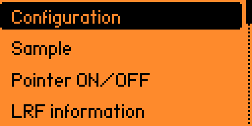
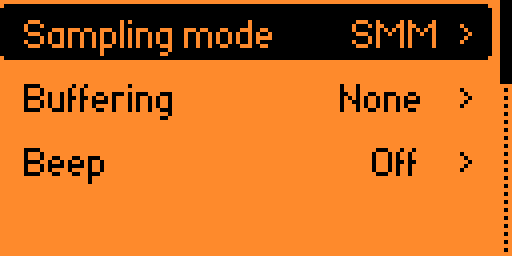
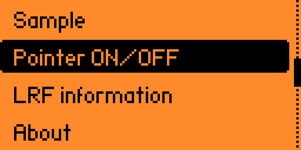
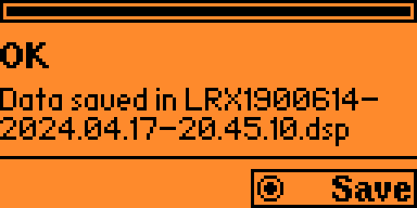

# Noptel LRF rangefinder sampler app for the Flipper Zero
### Version 1.3

* [Usage](#Usage)
* [Installation](#Installation)
* [Notes](#Notes)
* [License](#License)

Flipper Zero app to get range measurements from a [Noptel](https://noptel.fi/) [LRF rangefinder](https://noptel.fi/rangefinderhome).

https://github.com/Giraut/flipper_zero_noptel_lrf_sampler/assets/37288252/b974edca-b4ba-41a2-a545-af92c660ae58

## Usage

Start the application in **Apps ▶ GPIO**.

The main menu opens:

### Configuration

In the configuration menu, select the sampling mode:

- **SMM**: single measurement mode (default)
- **Auto SMM**: single measurement mode, auto-repeating
- **1 Hz** ▶ **200 Hz**: continuous measurement mode at the selected sampling rate

Set **Buffering** to buffer samples in automatic SMM or continuous measurement mode for either:

- **1 s** to **10 s**
- **5 samples**, **10 samples**, **100 samples** or **1000 samples**

Enable **Beep** to hear a short beep when a valid sample is received.

### Sample

Select the **Sample** option to start sampling the LRF.

#### Single measurement mode

In single measurement mode, press the **OK** button to get another measurement.

Up to 3 distances can be measured in one sample (several targets in the line of sight).

Each measured distance is displayed on one line.

The associated amplitude (i.e. signal strength) is displayed as a small number next to the distance.

#### Continuous measurement mode

In continuous measurement mode or automatic SMM mode, press the **OK** button to start and stop the measurements.

Distances and amplitudes are displayed like in single measurement mode.

The effective sampling rate in Hz is calculated and displayed at the bottom.

#### Buffering

If buffering is enabled, the following information is calculated:

- Average distances for all valid samples
- Average amplitudes (i.e. average signal strengths) for all valid samples
- Return rate (i.e. number of samples containing any measured distance vs. total number of sampling attempts)

The average distances and amplitudes are displayed instead of the last samples.

The buffering state is displayed at the bottom left: the bar is all the way up when the buffer is full.

The return rate is indicated next to the buffering state: the bar is all the way up when the return rate is 100% (meaning no missed measurements).

The buffering state and the return rate indicators are useful to determine the rangefinder's extinction ratio: when the buffer is full, the return rate bar should look about 3/4 full at extinction ratio.

### Pointer ON/OFF

Select the **Pointer ON/OFF** toggle to turn the pointer on and off if the rangefinder is equipped with a pointer.

The pointer is useful to line up the rangefinder on a short distance target.

### LRF information

Select the **LRF information** option to view the LRF's identification information. Press the **OK** button to re-read the information, or read another LRF's.

### Save LRF diagnostic

Select the **Save LRF diagnostic** option to save the LRF's diagnostic data after a failed ot incorrect measurement. Press the **OK** button to save another set of diagnostic data, or save another LRF's.

DSP files may be submitted to Noptel for analysis, along with a description of the problem with the rangefinder.

To recover the DSP files from the Flipper Zero, connect the Flipper Zero to the computer with a USB cable and use [qFlipper](https://docs.flipper.net/qflipper) to download the files saved in **SD Card/apps_data/noptel_lrf_sampler/**

### About

Gives information about the app and the GPIO pin connections needed to connect an LRF rangefinder to the Flipper Zero. Use the **OK** button or the arrows to switch pages.

## Installation

- Clone this repository
- Install [uFBT](https://github.com/flipperdevices/flipperzero-ufbt)
- Connect the Flipper Zero to the computer with a USB cable
- cd into the repository
- Invoke `ufbt launch` to install the app in the **Apps ▶ GPIO** menu and run it for the first time

## Notes

- Pin #15 (C1) may be used to control the LRF's power supply through a power MOSFET or a relay for example. If used, the app will turn on the rangefinder upon starting and turn it back off when exiting. This is useful if the LRF is battery-powered to keep the rangefinder connected to the Flipper Zero and conserve the battery when not in use. The use of this pin is entirely optional.

- LRX-series rangefinders may also be used with the app. However, they are usually configured as RS232 or RS422 serial devices, not as UART serial devices. Therefore, a UART-to-RS232 or UART-to-RS422 converter is usually required to connect the Flipper Zero's UART lines to an LRX rangefinder.

## License

MIT
