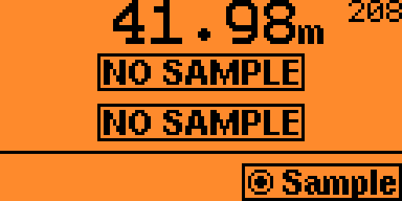
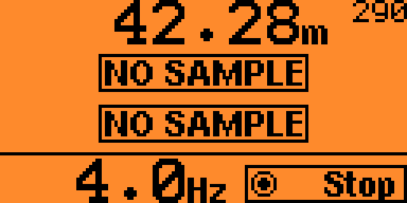
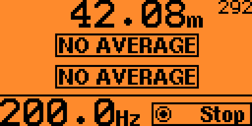
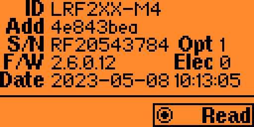
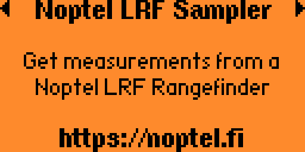

# Noptel LRF rangefinder sampler app for the Flipper Zero
### Version 1.2

* [Usage](#Usage)
* [Installation](#Installation)
* [Notes](#Notes)
* [License](#License)

Flipper Zero app to get range measurements from a [Noptel](https://noptel.fi/) [LRF rangefinder](https://noptel.fi/rangefinderhome).

https://github.com/Giraut/flipper_zero_noptel_lrf_sampler/assets/37288252/6a348eff-2909-4667-b35a-fc58f6944f01

## Usage

Start the application in **Apps ▶ GPIO**

The main menu opens:

### Configuration

In the configuration menu, select the sampling mode:

- **SMM**: single measurement mode (default)
- **1 Hz** ▶ **200 Hz**: continuous measurement mode at the selected sampling rate

Set **Averaging time** to average the distances / amplitudes of the samples over that time (default: no averaging).

Enable **Beep** to hear a short beep when a valid sample is received.

### Sample

Select the **Sample** option to start sampling the LRF.

#### Single measurement mode

In single measurement mode, press the **OK** button to get another measurement.

Up to 3 distances can be measured in one sample (several targets in the line of sight).

Each measured distance is displayed on one line.

The associated amplitude (i.e. signal strength) is displayed as a small number next to the distance.

#### Continuous measurement mode

In continuous measurement mode, press the **OK** button to start and stop the measurements.

Distances and amplitudes are displayed like in single measurement mode.

The effective sampling rate is calculated and displayed at the bottom.

#### Averaging

If an averaging time is configured, the average distances and amplitudes over that period of time are displayed instead of the last samples.

### Pointer ON/OFF

Select the **Pointer ON/OFF** toggle to turn the pointer on and off.

### LRF information

Select the **LRF information** option to view the LRF's identification information. Press the **OK** button to re-read the information, or read another LRF's.

### About

Gives information about the app and the GPIO pin connections needed to connect an LRF rangefinder to the Flipper Zero. Use the **OK** button or the arrows to switch pages.

## Installation

- Clone this repository
- Install [uFBT](https://github.com/flipperdevices/flipperzero-ufbt)
- Connect your Flipper Zero to the computer with a USB cable
- cd into the repository
- Invoke `ufbt launch` to install the app in the **Apps ▶ GPIO** menu and run it for the first time

## Notes

- Pin #15 (C1) may be used to control the LRF's power supply through a power MOSFET or a relay for example. If used, the app will turn on the rangefinder upon starting and turn it back off when exiting. This is useful if the LRF is battery-powered to keep the rangefinder connected to the Flipper Zero and conserve the battery when not in use. The use of this pin is entirely optional.

- LRX-series rangefinders may also be used with the app. However, they are usually configured as RS232 or RS422 serial devices, not as UART serial devices. Therefore, a UART-to-RS232 or UART-to-RS422 converter is usually required to connect the Flipper Zero's UART lines to an LRX rangefinder.

## License

MIT
